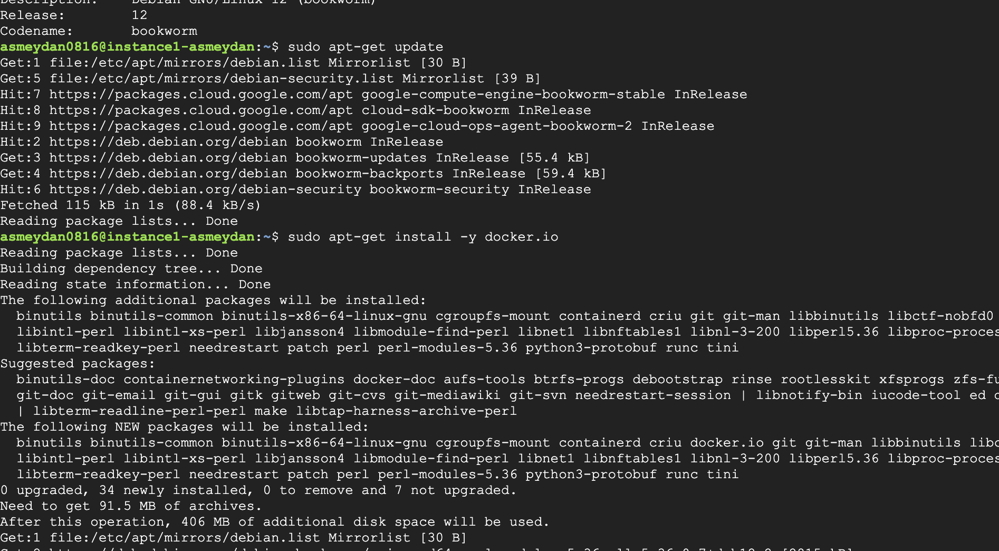

# google-cloud-connection

## Docker kurma
 VM'imize docker yüklüyoruz

 docker için gerekli ayarlamaları yaptıktan sonra kontrol ediyoruz

## Docker compose kurma
 Docker compose kurulmadığını farkediyorum ve manuel bri şekilde onu kuruyorum

## Container ayağa kaldırma
 Ardından docker-compose.yml dosyasının içindeki image oluşturabilmek için aşağıdaki işlemi yapıyoruz

## Çalışlşıp çalışmadığının kontrolü
containerları listeleyerek istediğimiz containerın çalıştığını görüyoruz

